---
hide:
  - navigation
  - toc
---

  <h1>Wahly a Ojo</h1>
  
A family cookbook. Recipes cooked <em>a ojo</em>.

  <h2 class="toc-chapter__heading">Chapter 1Alex</h2>
  <a class="toc-entry" href="recipes/black-beans/">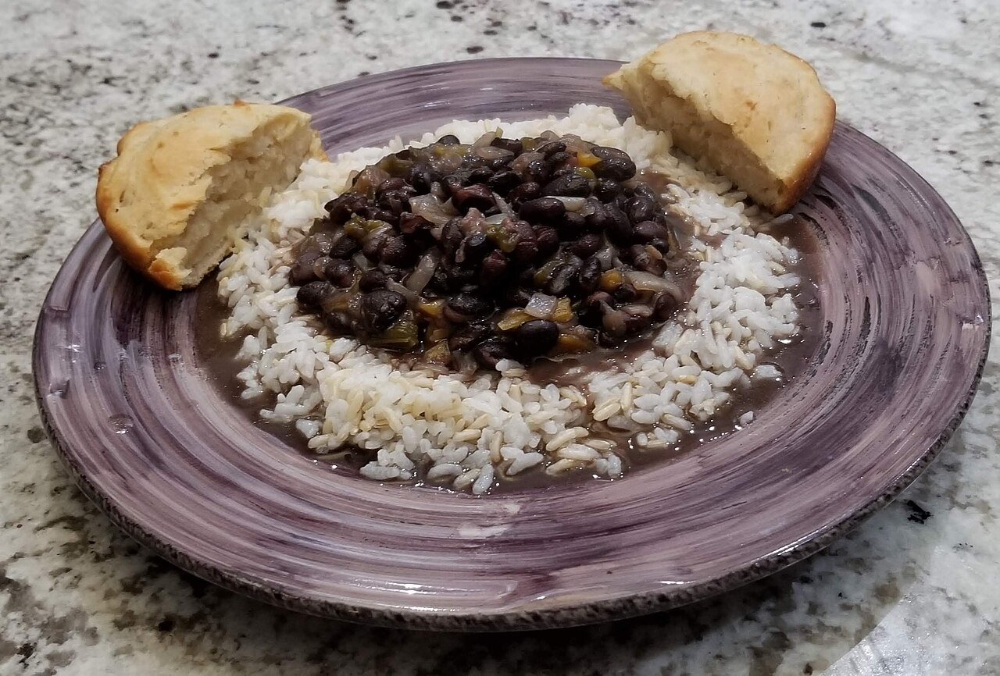Black BeansSide45 min cook</a>
  <a class="toc-entry" href="recipes/chili/">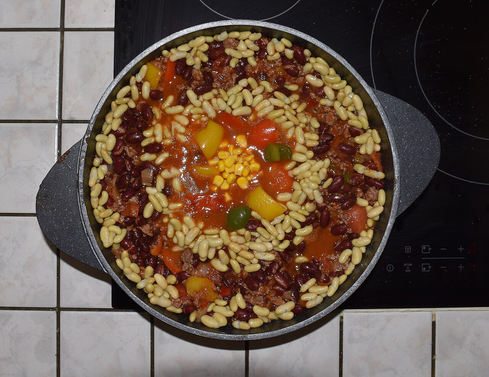ChiliEntree2 hrs cook</a>
  <a class="toc-entry" href="recipes/larb/">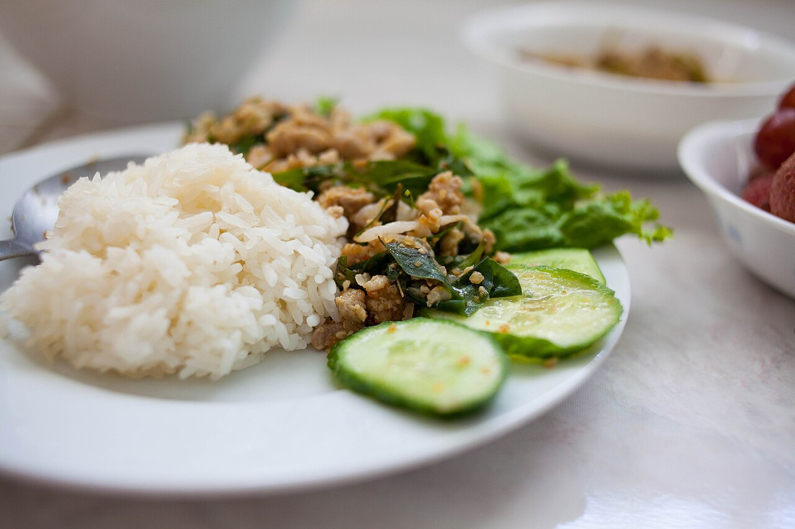LarbEntree25 min cook</a>

  <h2 class="toc-chapter__heading">Chapter 2Ben</h2>
  <a class="toc-entry" href="recipes/meatloaf/">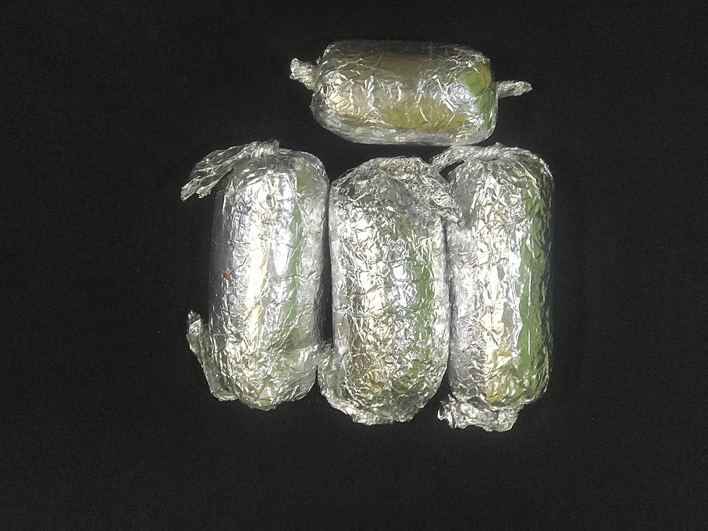MeatloafEntree1 hr cook</a>

  <h2 class="toc-chapter__heading">Chapter 3Carolyn</h2>
  <a class="toc-entry" href="recipes/breakfast-smoothie/">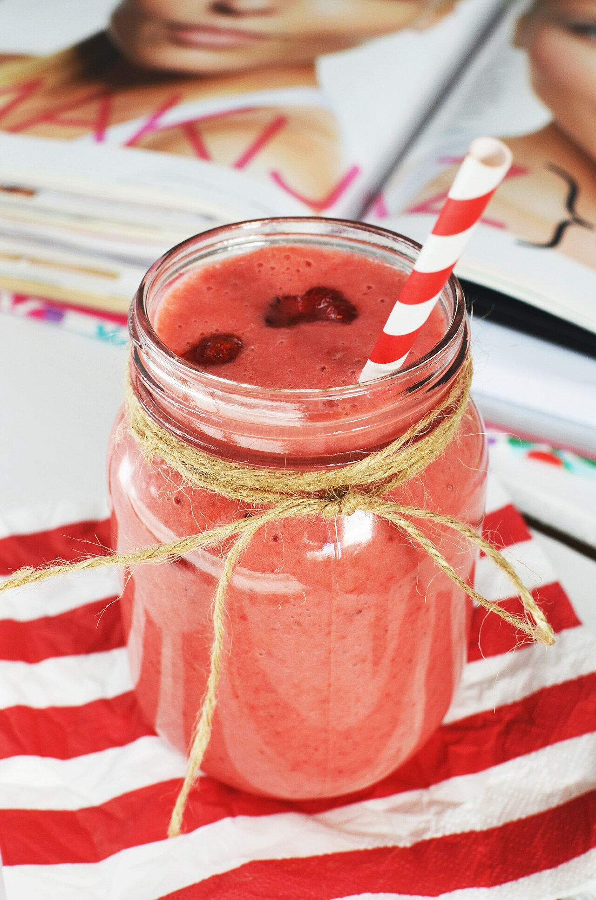Breakfast SmoothieBreakfast5 min prep</a>
  <a class="toc-entry" href="recipes/cinnamon-rolls/">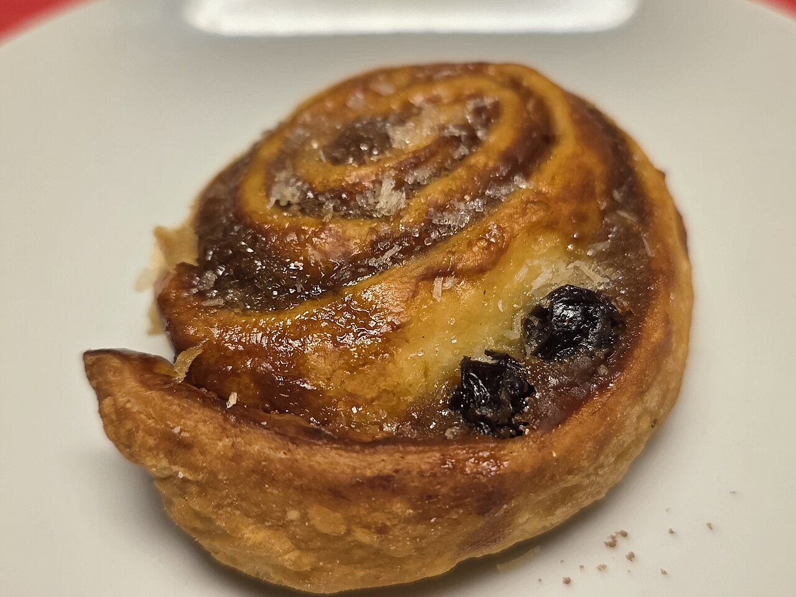Cinnamon RollsBreakfast25 min cook</a>
  <a class="toc-entry" href="recipes/sourdough-bread/">Sourdough BreadBread45 min cook</a>

  <h2 class="toc-chapter__heading">Chapter 4Ceci</h2>
  <a class="toc-entry" href="recipes/gazpacho/">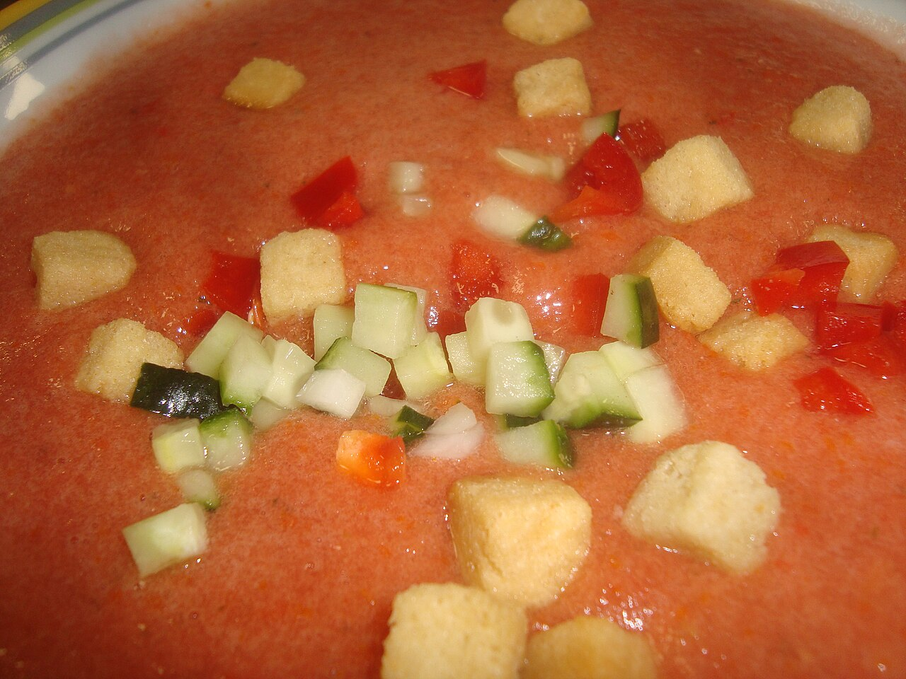GazpachoStarter20 min prep</a>
  <a class="toc-entry" href="recipes/mojo-pork/">Mojo PorkEntree3–4 hrs cook</a>
  <a class="toc-entry" href="recipes/paella/">PaellaEntree45 min cook</a>
  <a class="toc-entry" href="recipes/ropa-vieja/">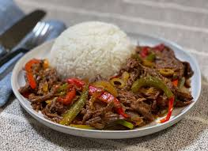Ropa ViejaEntree20 min cook</a>
  <a class="toc-entry" href="recipes/spanish-tortilla/">Spanish TortillaEntree30 min cook</a>

  <h2 class="toc-chapter__heading">Chapter 5Emily</h2>
  <a class="toc-entry" href="recipes/granola/">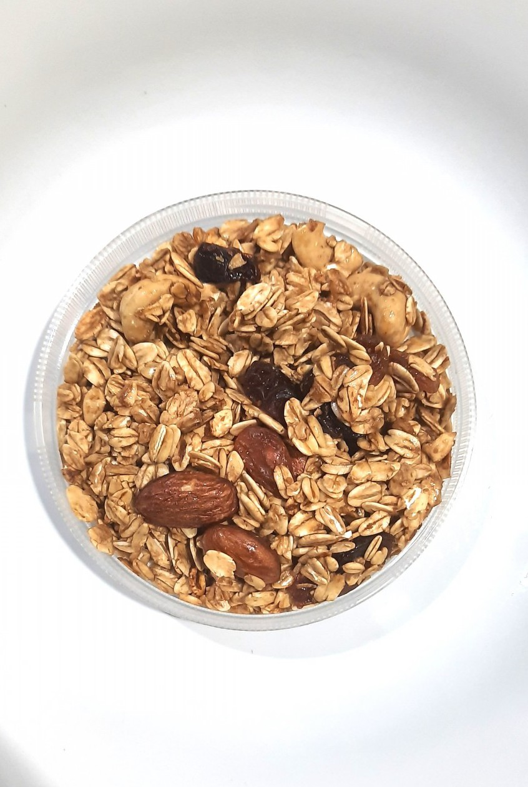GranolaBreakfast35 min cook</a>
  <a class="toc-entry" href="recipes/matzoh-ball-soup/">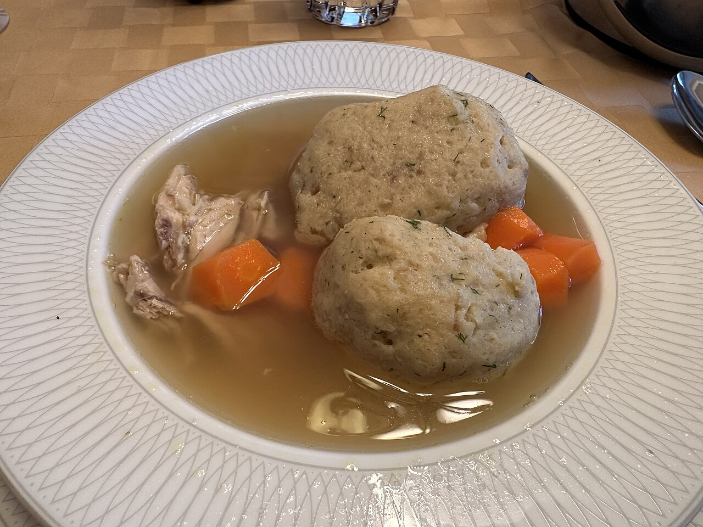Matzoh Ball SoupEntree1 hr cook</a>
  <a class="toc-entry" href="recipes/rice-krispy-treats/">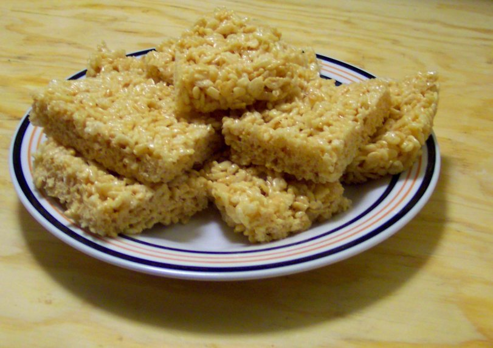Rice Krispy TreatsDessert15 min cook</a>

  <h2 class="toc-chapter__heading">Chapter 6Kunal</h2>
  <a class="toc-entry" href="recipes/milk-bread/">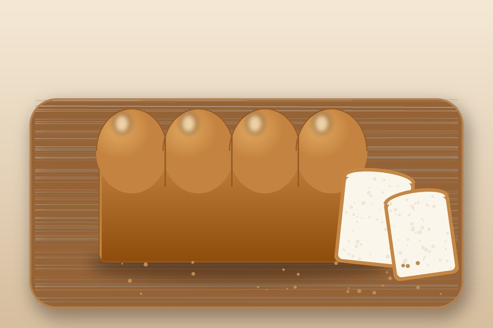Milk BreadBread35 min cook</a>

  <h2 class="toc-chapter__heading">Chapter 7Nate</h2>
  <a class="toc-entry" href="recipes/chicken-salad/">Chicken Salad15 min prep</a>

  <h2 class="toc-chapter__heading">Chapter 8Tim</h2>
  <a class="toc-entry" href="recipes/quesadilla/">Quesadilla15 min cook</a>

