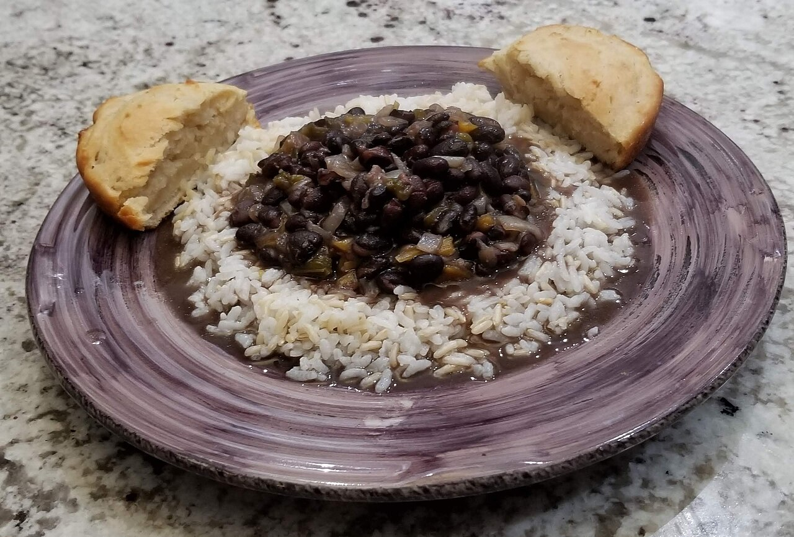

# Black Beans

Instant Pot black beans from dried. No soaking. The cinnamon is not optional.

## Ingredients

- 1 lb dried black beans, rinsed and picked through
- 1 onion, diced
- 4 cloves garlic, minced
- 1 cinnamon stick (or 1/2 tsp ground cinnamon)
- 1 tsp cumin
- 1 bay leaf
- 4 cups water or broth
- Salt
- Olive oil

## Instructions

1. Set the Instant Pot to sauté. Add oil, cook the onion until soft, then the garlic for a minute.

2. Add the beans, water, cumin, cinnamon stick, and bay leaf. Stir.

3. Lock the lid, set to pressure cook on high for 30 minutes. Let it natural release for at least 15 minutes, then quick release the rest.

4. Fish out the cinnamon stick and bay leaf. Salt generously — dried beans need more salt than you think. Taste and adjust.

## Peanut Gallery

**Carolyn:** Cinnamon in black beans.

**Nate:** I made that face too. It doesn't read as sweet, it just rounds out the cumin and makes the pot taste like it cooked twice as long as it did.

**Carolyn:** And no soaking?

**Nate:** Not in a pressure cooker. That's why you're using it.

**Carolyn:** My grandmother would like a word.

**Nate:** Your grandmother didn't have an appliance that also makes rice.

**Carolyn:** She had patience. Which is a thing you could try sometime.

**Nate:** Salt them harder than you think, by the way. Dried beans drink it up. They'll taste flat right until that last pinch and then the whole pot wakes up.

**Carolyn:** Fine. They're good. The cinnamon thing, I was wrong about.

**Nate:** Write that down too.

**Carolyn:** Don't push it.
