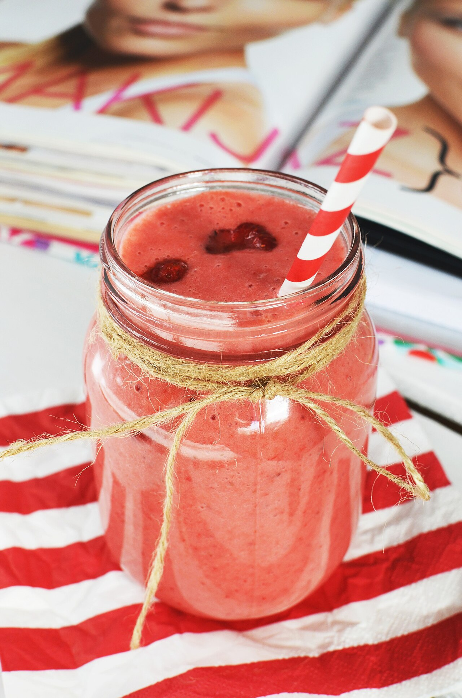

# Breakfast Smoothie

The everyday one. Thick, cold, a little tart. Built to keep you full past mid-morning, not to leave you starving by ten.

## Ingredients

- 1 frozen banana (ripe and spotty, frozen in chunks)
- 1 cup frozen mixed berries
- 1/2 cup Greek yogurt
- 1/2 cup milk or oat milk, plus more as needed
- 1 tbsp nut butter or a handful of oats
- Drizzle of honey, if your fruit isn't sweet
- Tiny pinch of salt

## Instructions

1. Use frozen fruit, not ice. The frozen banana is what makes it thick and creamy instead of cold and watery — freeze peeled chunks ahead of time so you always have some.

2. Layer it smart: liquid first, then yogurt, then the frozen fruit on top. The blades catch the soft stuff first and everything blends smoother.

3. Blend until completely smooth — no chunks, no frozen pocket spinning in place. If it stalls, add milk a splash at a time rather than just running the motor longer.

4. Taste it. Too tart, add honey; too thick, more milk; too thin, a few more frozen berries. Pour into a cold glass and go.

## Peanut Gallery

**Alex:** A smoothie recipe. We have officially run out of things to write down.

**Nate:** Mock it, but the frozen banana part is real. Ice makes it cold and watery. A frozen banana makes it a milkshake that's technically breakfast.

**Alex:** Okay, that one's good.

**Nate:** Put the nut butter or the oats in too, or you're starving by ten. Sugar water doesn't hold you.

**Alex:** Carolyn puts a pinch of salt in hers.

**Nate:** Does that do anything?

**Alex:** Infuriatingly, yes. Makes the fruit taste more like fruit. I've stopped trying to understand it.
