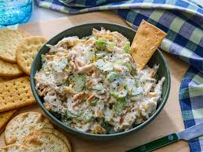

# Chicken Salad

Rotisserie chicken from the store is fine. Leftover roast chicken is better. Whatever you have works.

## Ingredients

- Cooked chicken, shredded or chopped
- Mayo — enough to make it creamy, probably more than you think
- Salt and pepper
- Lemon juice or a splash of pickle juice — one of these, not optional

Pick a direction and go with it:

Classic: celery, red onion, dijon, tarragon

Bright and herby: scallions, a lot of fresh dill, lemon juice instead of pickle juice

Tangy: pickles, dijon, scallions, a little hot sauce

Sweet and crunchy: grapes or apple, toasted walnuts or pecans, tarragon or chives

## Instructions

1. Shred or chop the chicken. Smaller pieces hold together better in a sandwich, bigger chunks are more satisfying to eat plain. Pick based on how you're serving it.

2. Mix in mayo until it looks right. Start with less, add more. You want it cohesive and a little creamy, not dry, not soupy.

3. Salt and pepper, then taste it.

4. Add whatever you picked from the list above. The acid — lemon juice or pickle juice — goes in last, just a little, and it makes a noticeable difference.

5. Taste, adjust, done. Let it sit in the fridge for a bit if you can.

## Unsolicited Opinions

**Carolyn:** Nate wrote a recipe that is essentially just vibes and I respect it deeply.

**Alex:** "Mayo — enough to make it creamy, probably more than you think." That is doing a lot of work as an instruction.

**Carolyn:** It's accurate though. People always under-mayo.

**Alex:** I made the dill version and the grape-and-walnut version in the same week.

**Carolyn:** Are they the same dish?

**Alex:** Not remotely. They should have different names.

**Carolyn:** "Herb Situation" and "The Fancy One."

**Alex:** Do not skip the acid at the end. I skipped it once. The salad knew.

**Carolyn:** What does that mean?

**Alex:** It tasted sad. Just use the pickle juice.

**Carolyn:** Make the dill version first. Put it on sourdough.

**Alex:** We don't have sourdough anymore.

**Carolyn:** ...

