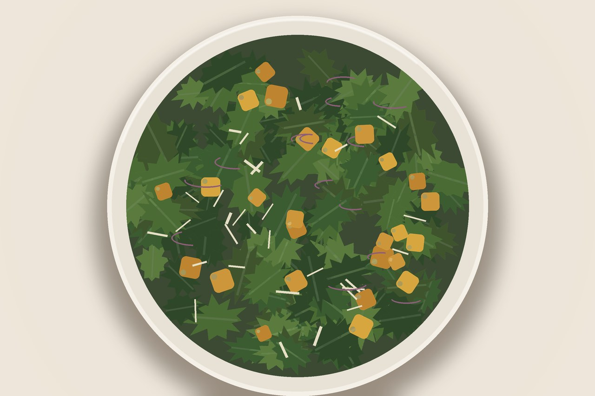

# Kale Caesar Salad

A Caesar that won't turn to soup. The kale holds up, the croutons are homemade, and the dressing hides six anchovies you'll never see coming.

## Ingredients

- 2 bunches Tuscan or curly kale (about 1 lb), stems stripped, leaves roughly chopped
- 5 tbsp olive oil, divided
- 5 oz hearty bread, torn into chunks
- Salt and pepper
- 2/3 cup mayonnaise
- 6 anchovy filets
- 1 garlic clove, minced
- 3/4 cup finely grated Parmesan (about 1 1/2 oz)
- 2 tsp Worcestershire sauce
- 2 tbsp lemon juice (about 1 lemon)
- 1 small white onion or 2 shallots, thinly sliced

## Instructions

1. Strip the kale off its stems, tear the leaves into a big bowl, and pour over 3 tbsp of the oil. Massage it in with your hands for a couple minutes — the leaves should darken, turn silky, and shrink down by half. Set aside.

2. Croutons: pulse the bread with the remaining 2 tbsp oil in a food processor until you've got pea-sized crumbs, then season with salt and pepper. Spread on a sheet pan and bake at 350°F until pale gold and crisp, about 20 minutes. You'll smell toast when they're ready.

3. Wipe out the processor and add the mayo, anchovies, garlic, Parmesan, Worcestershire, and lemon juice. Blitz until smooth and creamy. Taste — it should be punchy and a little salty; nudge with more salt and pepper if it needs it.

4. Toss the kale with the sliced onion, all the dressing, and half the croutons until every leaf is coated. Scatter the rest of the croutons on top and serve.

## Peanut Gallery

**Tim:** Six anchovies? In a salad?

**Ben:** You won't taste them as fish — they melt into the dressing and just make it taste like Caesar. Leave them out and it's mayo on a leaf.

**Carolyn:** The raw white onion is what worries me. Thinly sliced, sure, but that's still a lot of onion.

**Ben:** Soak the slices in cold water for ten minutes and pat them dry. Takes the raw bite off and keeps the crunch.

**Carolyn:** See, *that* I'll do.

**Tim:** And the massaging — actually necessary or just a vibe?

**Ben:** Necessary. Throw a pinch of salt in while you work the oil in, and don't rush it. When the leaves go dark and glossy and shrink to half the volume, they're done. Undermassaged kale is basically eating a hedge.

**Carolyn:** A hedge with croutons.

**Tim:** Last one — this whole thing holds up, right? Kale doesn't wilt like romaine.

**Ben:** Best part. Dress it and let it sit fifteen minutes before serving and it only gets better. Try that with a real Caesar and you've got soup.
