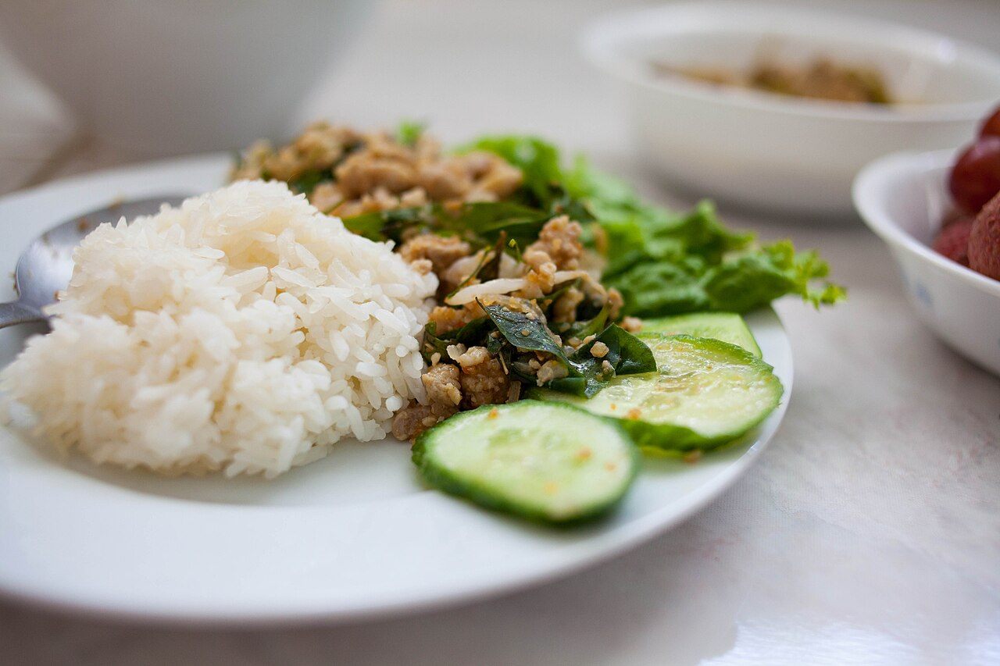

# Larb

Ground turkey larb. The toasted rice powder is the whole thing — don't skip it, don't buy it pre-made.

## Ingredients

- 1 lb ground turkey
- 1/4 cup uncooked jasmine rice (for toasting)
- 3 tbsp fish sauce
- 3 tbsp lime juice (about 2 limes)
- 1 tsp sugar
- 1/2 tsp red pepper flakes or dried chili flakes
- 3–4 shallots, thinly sliced
- Handful of fresh mint leaves
- Handful of fresh cilantro
- Scallions, sliced
- Butter lettuce leaves for serving

## Instructions

1. Toast the rice. Dry skillet, medium heat, toss the raw rice in and shake it around for several minutes until it's golden brown and smells nutty. Let it cool, then grind it in a mortar and pestle or spice grinder until it's a coarse powder. This is what makes it larb.

2. Cook the turkey in a skillet over medium-high heat, breaking it up as it goes. No oil needed — it'll render enough. Season lightly with salt while it cooks.

3. While the meat cooks, mix the fish sauce, lime juice, sugar, and chili flakes together.

4. When the turkey is cooked through, take it off the heat. Pour the dressing over it and toss. Add the shallots, most of the herbs, and the toasted rice powder. Toss again.

5. Serve in lettuce cups with the rest of the herbs on top.

## Peanut Gallery

**Carolyn:** He grinds his own rice for this?

**Ben:** Takes three minutes and it changes the dish. The store-bought stuff tastes like nothing. Toast yours until it's deep golden and smells nutty, then grind it coarse, not to flour. You want to feel some grit.

**Carolyn:** I believe you. I'm just noting the energy.

**Ben:** It's where the texture comes from. Nothing else in that bowl crunches.

**Carolyn:** Sounds fine without it.

**Ben:** It is fine without it. Fine isn't the goal.

**Carolyn:** The fish sauce amount seems aggressive.

**Ben:** It seems aggressive and then you taste it and it's right. Dress the turkey while it's still warm, too. It drinks the lime and fish sauce up instead of letting it slide off.

**Carolyn:** I trust the fish sauce more than I trust either of you.

**Ben:** That's fair.
