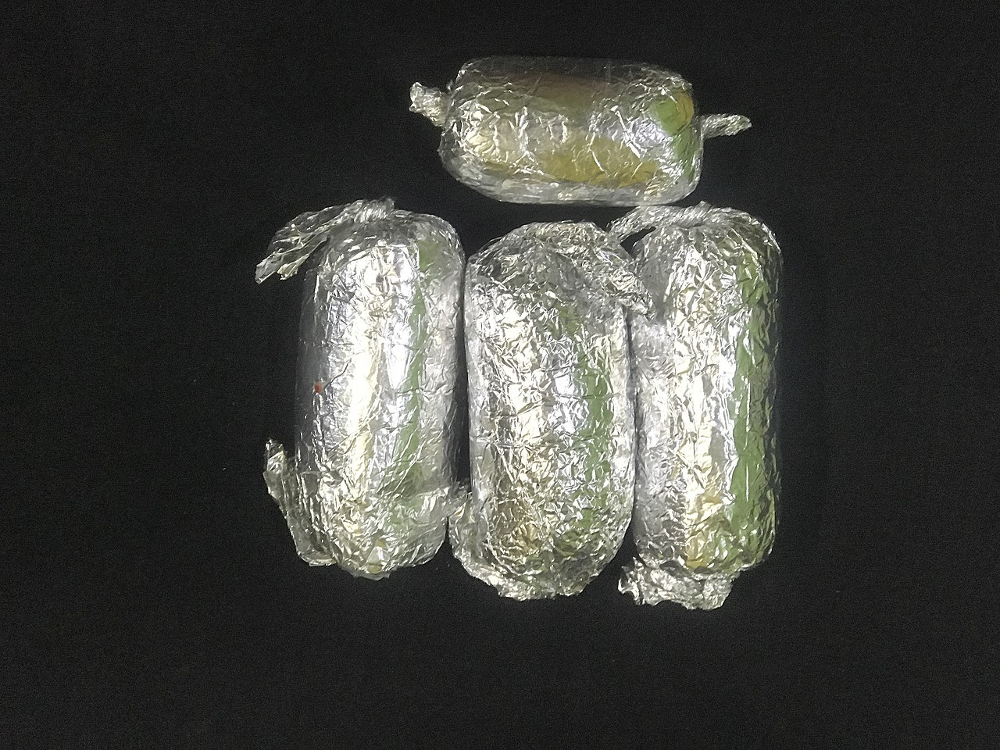

# Meatloaf

## Ingredients

- 2 lbs ground beef (80/20)
- 1 cup breadcrumbs
- 2 eggs, beaten
- 1/2 cup milk
- 1 onion, finely diced
- 2 cloves garlic, minced
- 2 tbsp Worcestershire sauce
- 1 tsp salt
- 1/2 tsp black pepper
- 1/2 tsp onion powder

### Glaze

- 1/2 cup ketchup
- 2 tbsp brown sugar
- 1 tbsp mustard

## Instructions

1. Heat the oven to 375°F. Mix the breadcrumbs and milk in a bowl and let it sit for a few minutes so the crumbs soak it up.

2. Combine the beef, eggs, soaked breadcrumbs, onion, garlic, Worcestershire, salt, pepper, and onion powder. Mix it with your hands until it's just combined. Don't overwork it or it'll be dense.

3. Shape it into a loaf on a lined baking sheet or press it into a loaf pan. Free-form on the sheet gets better edges.

4. Mix the ketchup, brown sugar, and mustard together. Spread it over the top of the loaf.

5. Bake for about 50–60 minutes until it reads 160°F in the center. Let it rest for 10 minutes before slicing.

## Peanut Gallery

**Alex:** This is a meatloaf that knows what it is. No sun-dried tomatoes, no identity crisis.

**Carolyn:** The ketchup glaze is correct. Anyone who puts barbecue sauce on meatloaf is trying too hard.

**Alex:** Soak the breadcrumbs. That's what keeps it tender. Skip it and you've got a brick.

**Carolyn:** Ben, free-form or loaf pan?

**Alex:** Free-form. The edges caramelize where the glaze runs down.

**Carolyn:** Meatloaf sandwich the next day. Cold, with mustard.

**Alex:** Nobody's impressed by this recipe until they eat it, and then they want it every week.

**Carolyn:** Highest compliment a meatloaf can get.
