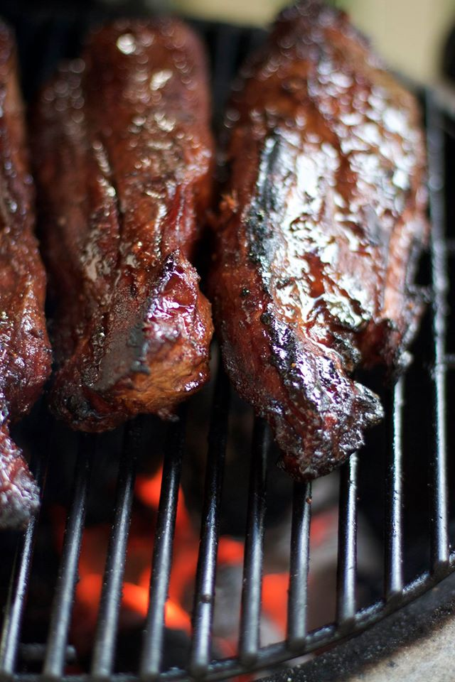

# Mojo Pork

Slow-cooked pork shoulder drenched in a garlicky citrus mojo. The crust at the end is non-negotiable — that's where the magic lives.

## Ingredients

- 4 lbs pork shoulder, cut into 3–4 large chunks
- 10 cloves garlic, minced or mashed
- 1 cup sour orange juice (or 3/4 cup orange juice + 1/4 cup lime juice)
- 1/4 cup olive oil
- 2 tsp ground cumin
- 1 tbsp dried oregano
- 1 tsp salt
- 1/2 tsp black pepper
- 1 large onion, sliced into thick rings

## Instructions (Instant Pot)

1. Mash the garlic with the salt into a rough paste — a mortar and pestle is ideal, a fork and cutting board works. Mix it with the sour orange juice, olive oil, cumin, and oregano. Score the pork chunks deeply with a knife, then pour the mojo all over and into every cut. Marinate at least an hour, overnight if you can.

2. Set the Instant Pot to sauté and get it hot. Pull the pork out of the marinade (save that liquid) and sear each piece until it's golden brown on at least two sides. It should smell like toasted garlic and cumin. Don't rush this.

3. Lay the onion rings on the bottom, nestle the pork on top, and pour in the reserved marinade. Lock the lid and pressure cook on high for 45 minutes, then let it natural release for 15 minutes before venting.

4. Pull the pork out and shred it with two forks — it should fall apart with almost no effort. Spoon some of the cooking liquid over the shredded meat to keep it juicy.

5. Spread the shredded pork on a sheet pan and broil for 3–5 minutes until the edges get dark and crispy. Watch it closely — you want charred tips, not ash. Squeeze fresh lime over the top before serving.

## Instructions (Stove & Oven)

1. Mash the garlic with the salt into a rough paste — a mortar and pestle is ideal, a fork and cutting board works. Mix it with the sour orange juice, olive oil, cumin, and oregano. Score the pork chunks deeply with a knife, then pour the mojo all over and into every cut. Marinate at least an hour, overnight if you can.

2. Heat a Dutch oven over medium-high heat with a splash of oil. Pull the pork out of the marinade (save that liquid) and sear each piece until it's golden brown on at least two sides. It should smell like toasted garlic and cumin. Don't rush this.

3. Lay the onion rings on the bottom, put the pork back in, and pour the reserved marinade over everything. Add a splash of water if the liquid doesn't come at least halfway up the meat. Bring to a simmer, cover with the lid, and slide it into a 325°F oven.

4. Braise for 3 to 3.5 hours, flipping the pork once halfway through. It's done when a fork slides through the meat like butter. Pull it out and shred it with two forks, spooning the braising liquid over the meat as you go.

5. Spread the shredded pork on a sheet pan and broil for 3–5 minutes until the edges get dark and crispy. Watch it closely — you want charred tips, not ash. Squeeze fresh lime over the top before serving.

## Unsolicited Opinions

**Nate:** Four pounds of pork and ten cloves of garlic. This is a recipe or a dare?

**Ben:** It's correct. If anything, the garlic could go higher. Mash it into a paste with the salt — a mortar and pestle turns it into something the marinade can actually carry into the meat. Mincing is fine. A garlic press is fine. Just don't skip the mashing-with-salt part.

**Nate:** The overnight marinade thing — is it actually worth it or is that just recipe guilt?

**Ben:** It's worth it. An hour gets you a good dinner. Overnight gets you the dinner you brag about. The sour orange needs time to work into those score marks.

**Nate:** I can't find sour oranges anywhere.

**Ben:** Three parts OJ to one part lime juice. Not identical, but close enough that nobody at the table will know. Use fresh citrus though — bottled juice makes the whole thing taste flat.

**Nate:** The broil step at the end feels like showing off.

**Ben:** It's the most important step in the recipe. You just spent hours making tender pulled pork — the broil gives it texture. Crispy edges against soft meat is the whole point. Two minutes of attention for a completely different dish.

**Nate:** I'm doing the Instant Pot version.

**Ben:** Both are good. The oven version gives you a deeper fond and a slightly richer sauce. The Instant Pot gets you there on a Tuesday night. No wrong answer, but don't skip the sear either way.
