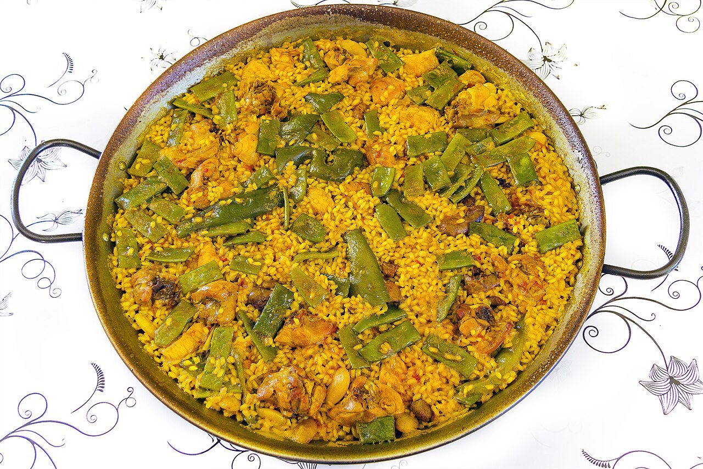

# Paella

Paella valenciana — chicken, beans, saffron rice, and a toasted crust on the bottom worth fighting over. You need a wide pan; the rice should sit in a thin layer, not a deep pile.

## Ingredients

- 2 cups bomba or other short-grain Spanish rice
- 1 lb chicken thighs, cut into pieces
- A big handful of flat green beans, trimmed
- 1 cup butter beans or lima beans
- 1 tomato, grated
- 1 tsp sweet paprika (pimentón)
- A good pinch of saffron
- 5 cups warm chicken broth
- Olive oil and salt
- A sprig of rosemary
- Lemon wedges, for serving

## Instructions

1. Heat olive oil in the widest pan you own. Brown the chicken hard on all sides, salting as you go, then push it out to the edges. You want real color here — that's where the flavor starts.

2. Add the green beans and butter beans, then the grated tomato and paprika. Cook it down until the tomato darkens, goes jammy, and smells sweet — just don't let the paprika scorch or it turns bitter.

3. Pour in the warm broth, crumble in the saffron, drop in the rosemary, and bring it to a strong simmer. Taste it: it should be a touch too salty right now, because the rice will soak that up and mellow it.

4. Scatter the rice in evenly and spread it flat. Now do not stir it again — ever. Stirring releases starch and you'll have risotto. Keep it at a steady bubble, turning the pan for even cooking, for about 18 minutes until the liquid is gone.

5. Crank the heat the last minute or two to build the socarrat, the toasted crust on the bottom — listen for a faint crackle and smell for toasty, not burnt. Rest it under foil for 5 minutes, then serve with lemon.

## Unsolicited Opinions

**Alex:** "Do not stir again, ever" is in all caps in Ceci's notes. Underlined twice.

**Carolyn:** Because it's the one thing everyone gets wrong. Stir it and you've made risotto with a Spanish accent.

**Ben:** What's the socarrat? She drops it in like I'm supposed to already know.

**Alex:** The crispy toasted layer of rice on the bottom of the pan. It's the best part. You build it on high heat right at the end.

**Carolyn:** And use the widest pan you have. Paella wants a thin layer of rice — pile it deep and it steams instead of cooking properly.

**Ben:** So the socarrat is the burnt bit on purpose.

**Carolyn:** Toasted. Say toasted in front of Ceci or she will take the pan back.

**Alex:** Warm the broth before it goes in, too. Cold broth shocks the rice and the cooking goes uneven.
