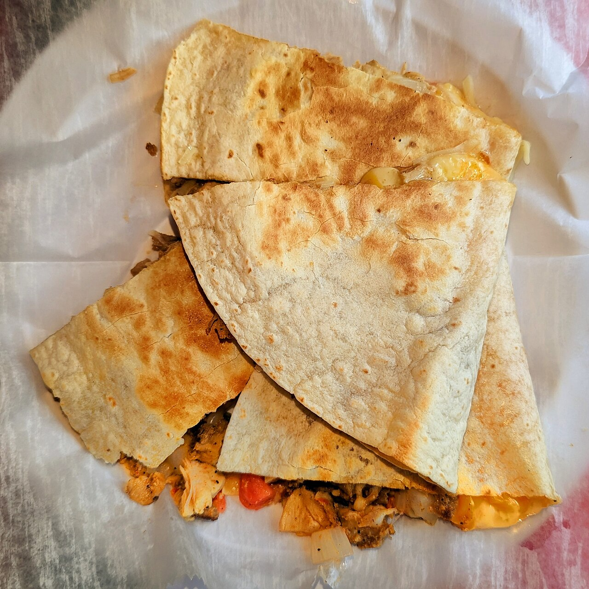

# Quesadilla

The fast lunch that lives or dies on two things: the cheese and the heat. Get those right and the rest is just decoration.

## Ingredients

- 2 large flour tortillas
- 2 cups shredded cheese (Monterey jack, Oaxaca, or a jack-cheddar mix)
- Cooked filling: shredded chicken, sautéed peppers and onion, whatever you've got
- A little butter or oil
- Salt
- For serving: salsa, sour cream, lime, hot sauce

## Instructions

1. Grate your own cheese off the block. Pre-shredded is coated in starch so it doesn't clump in the bag — which also means it never melts into that proper gooey pull. This is the one non-negotiable.

2. Set a skillet over medium and butter it lightly. Lay a tortilla down, scatter cheese over half, add your filling, then a little more cheese on top — cheese against both sides of the fold glues the whole thing shut. Fold it over.

3. Listen for a steady, gentle sizzle, not a violent one. Too hot and the outside chars before the cheese gives up. Press down softly with a spatula.

4. Flip when the underside is golden and freckled with brown spots, about 2–3 minutes a side. The second side always goes faster, so watch it.

5. Slide it out and wait a full minute — molten cheese is a trap and you know it. Cut into wedges and serve with salsa and a squeeze of lime.

## Unsolicited Opinions

**Carolyn:** Tim wrote half a page about cheese and two lines about everything else.

**Alex:** Because the cheese is the entire ballgame. Pre-shredded cheese has sawdust in it. It will not melt right.

**Carolyn:** It's cellulose, not sawdust.

**Alex:** It's sawdust's cousin and it ruins quesadillas. Grate the block.

**Carolyn:** The medium-heat note is the other real one. People crank the burner, char the tortilla, and the cheese inside is still a cold solid.

**Alex:** Patience. A quesadilla is a slow handshake, not a fistfight.

**Carolyn:** Put that on the wall.

**Alex:** One more: a thin layer of cheese against each tortilla with the filling in between. It welds the whole thing together so it doesn't explode when you flip it.
