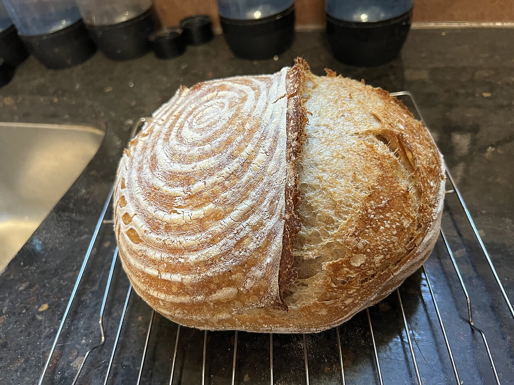

# Sourdough Bread

A basic country loaf. This is mostly waiting — the hands-on time is small, the patience is large. Start the morning before you want bread.

## Ingredients

- 500g bread flour
- 350g water, room temperature
- 100g active sourdough starter (bubbly and risen, not flat)
- 10g salt

## Instructions

1. Mix the flour and water with your hands until there are no dry bits left, then let it rest 30–60 minutes. Add the starter and salt and squish everything through your fingers until it goes from shaggy to smooth and tacky — it should grab your hand a little.

2. Over the next 2–3 hours, do a few rounds of stretch-and-folds: wet your hand, grab one side of the dough, stretch it up and fold it over, turn the bowl, repeat four times. It'll feel slack at first and slowly turn smooth, pillowy, and strong.

3. Let it bulk ferment at room temperature until it's risen by about half, looks domed, and has a few bubbles on top. Give the bowl a jiggle — it should wobble like it's alive.

4. Tip it out, shape it into a tight ball by dragging it across the counter to build tension on the surface, and settle it seam-up in a floured bowl or banneton. Cover and cold-proof in the fridge overnight (8–14 hours).

5. Bake in a screaming-hot Dutch oven at 500°F: score the top with one confident half-inch slash, lid on for 20 minutes, then lid off and drop to 450°F for 20–25 more until it's deep brown and sounds hollow when you tap the bottom. Cool it completely — listen for the crust crackling as it sets.

## Peanut Gallery

**Alex:** Carolyn has a sourdough starter with a name, doesn't she.

**Tim:** Her name is Brenda, and Carolyn talks about Brenda more than she talks about most people.

**Alex:** The bread is incredible though. Annoyingly.

**Tim:** Wait for the starter to actually peak. Bubbly and domed, not flat. Float a spoonful in water and if it sinks, it isn't ready.

**Alex:** And score it deep. One half-inch slash, committed. Timid little scratches and it bursts open at the side like it's embarrassed.

**Tim:** Don't cut it hot, either. The inside is still setting and you'll get gummy bread.

**Alex:** "Listen to your bread cool" is the most Carolyn sentence ever recorded, and here we are, listening to bread.
