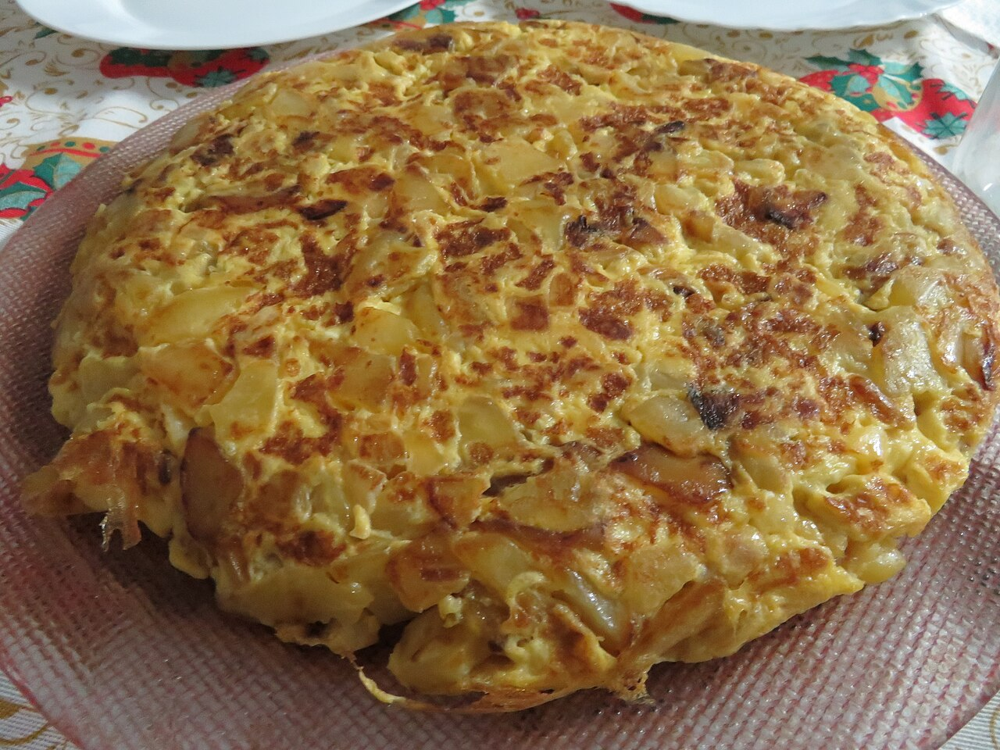

# Spanish Tortilla

Tortilla de patatas. Potatoes, eggs, onion, olive oil — that's the whole list, and it's somehow one of the best things you can make. Good warm, even better at room temperature.

## Ingredients

- 5 medium potatoes, peeled and thinly sliced
- 1 large onion, thinly sliced
- 6 eggs
- Olive oil, enough to nearly cover the potatoes (about 1 1/2 cups)
- Salt

## Instructions

1. Heat a generous pool of olive oil in a skillet over medium-low. Slip in the potatoes and onion, salt them, and poach gently — they should bubble softly, never crisp up or brown. Stir now and then until they're meltingly soft, about 20 minutes.

2. Drain the potatoes and onion in a sieve, saving that good oil. Let them cool for a couple of minutes so they don't scramble the eggs on contact.

3. Beat the eggs with a good pinch of salt in a big bowl, then fold the warm potatoes in. Let it sit 5–10 minutes — the potatoes drink up the egg, and that's the secret to a tortilla that holds together instead of falling apart.

4. Heat a few spoonfuls of the reserved oil in a nonstick pan over medium. Pour everything in, settle it into an even round, and cook until the edges set and the bottom turns golden — slide a spatula underneath to peek.

5. Now the flip: cover the pan with a plate, turn the whole thing out onto it, then slide it back in to set the other side for a few minutes. Keep the center just barely soft — you want jammy, not dry.

## Unsolicited Opinions

**Alex:** Onion in a tortilla. Ceci has picked a side in a war that has genuinely ended friendships in Spain.

**Carolyn:** Team onion is correct. It goes sweet and soft and makes the whole thing taste like more than eggs and potatoes.

**Alex:** I'm not arguing. I'm just noting that she put it in print. That's a bold woman.

**Carolyn:** The real tip is the resting step — letting the potatoes soak in the beaten egg before it hits the pan. That's why hers holds together and yours slides apart in the flip.

**Alex:** And pull it while the center's still a little soft. It keeps cooking from its own heat after the flip. A dry tortilla is a sad tortilla.

**Carolyn:** Jammy middle or it didn't happen. Don't let it set into a frittata.
